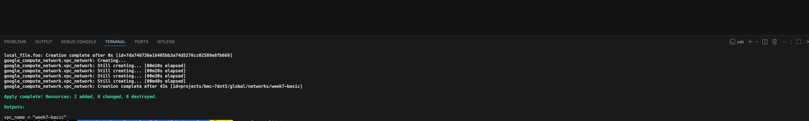
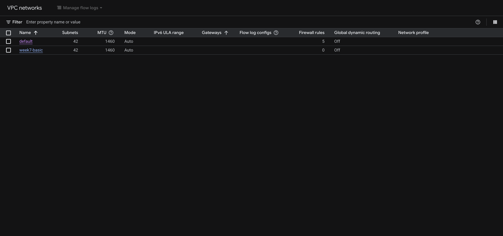

---
tags:
  - GCP
  - VPC
  - LOCAL FILES
  - TERRAFORM
name: Week 7 Homework
week: "7"
---

# Week 7 Homework

This week's homework will cover creating a new repository in GitHub as well as creating a GCP VPC and local file using terraform.

# Deliverables

- [x] Proof of Terraform Apply
      
- [x] Proof of VPC Created
      

# Walkthroughs and Notes

- [Creating a GitHub Repository](./docs/github-walkthrough.md)
- [Creating a VPC and Local File with Terraform](./docs/terraform-resources.md)
- [Additonal Notes](./docs/notes.md)
